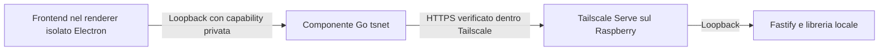

# App desktop privata per Windows, macOS e Linux

Implementazione dell'8 ottobre 2026. Electron contiene il componente Go `tsnet` di Tailscale. Gli amici installano solo MediaPiayer. Non occorre configurare una VPN per tutto il computer.

Il primo avvio chiede l'indirizzo HTTPS del Pi e la chiave monouso Tailscale. In alternativa si apre il login ufficiale Tailscale nel browser. Dopo la registrazione, l'identità del nodo viene conservata cifrata con AES-GCM; la chiave di cifratura è protetta con `safeStorage` di Electron, usando Keychain su Mac e DPAPI su Windows. La chiave di registrazione non viene scritta nella configurazione, in argomenti di processo o nei log. Ogni installazione ha un'identità distinta.

Puoi preparare l'indirizzo e attivare Tailscale Serve in seguito: nessun indirizzo reale è necessario per compilare o aprire gli installer. L'accesso alla biblioteca richiede invece che il Raspberry sia configurato e raggiungibile.



Il componente Go inoltra soltanto verso l'origine HTTPS `.ts.net` configurata, con controllo normale del certificato. Range HTTP, streaming HLS e WebSocket usano lo stesso ponte. Il listener locale sceglie una porta casuale, controlla Host e Origin e richiede una capability casuale di 256 bit aggiunta dal processo principale Electron. La capability non è disponibile al JavaScript del frontend e non viene inoltrata al Raspberry. Non è un proxy di navigazione generico.

Il tratto locale usa HTTP su loopback, non attraversa la rete. I cookie del Pi restano HttpOnly e SameSite=Strict, ma il ponte rimuove Secure solo nella copia locale per renderli utilizzabili su quel tratto. Sono conservati in una sessione Electron non persistente, cancellata alla disconnessione. Alla chiusura l’app tenta anche di revocare la sessione sul server; se la rete è già caduta, si può revocarla da Profile o dal Pi. All'avvio successivo la rete si riconnette, mentre l'account mediaPiayer richiede nuovamente il login. Lo stato VPN è persistente; le sessioni applicative non vengono salvate sul disco dall'app.

## Preparare il Raspberry

Questi passaggi richiedono accesso amministrativo al Pi e alla console Tailscale. Non sono stati eseguiti su un Raspberry reale durante lo sviluppo.

1. Installare Raspberry Pi OS a 64 bit supportato, Node 24 LTS, ffmpeg e tool per i moduli nativi. Usare Ethernet e supporti affidabili. Controllare che `/usr/bin/node` punti alla versione richiesta dal servizio.
2. Installare il progetto in `/opt/mediapiayer` con un account di deploy distinto dall'utente di runtime. Installare con `npm ci`, poi `npm ci --prefix frontend`, infine `npm run build`. Il runtime non deve poter modificare il codice o invocare sudo.
3. Creare l'utente di servizio `mediapiayer` senza login interattivo e preparare `/opt/mediapiayer/data` e `/srv/mediapiayer`. Solo queste directory devono essere scrivibili dal servizio. Copiare i contenuti media in `/srv/mediapiayer/{movies,series,music,posters}`.
4. Copiare `deploy/mediapiayer.env.example` in `/etc/mediapiayer.env`, sostituire indirizzo e segreto. Generare localmente `JWT_SECRET` con `openssl rand -hex 32`. Il file deve essere leggibile soltanto da root. Per comandi amministrativi che caricano direttamente l'env, usare una shell amministrativa locale o un file `.env` temporaneo protetto; non passare segreti sulla riga di comando.
5. Il servizio ascolta su `127.0.0.1:3000`. Installare Tailscale sul Pi, attivare MagicDNS e HTTPS, poi eseguire `sudo tailscale serve --bg 3000`. Copiare l'origine esatta mostrata da `tailscale serve status` in `PUBLIC_ORIGIN`, senza slash finale. Verificare `tailscale funnel status`: non deve esserci una pubblicazione pubblica.
6. Creare il primo admin localmente con `npm run users -- create --email tuo@example.com --name Admin --role admin`. Il comando genera una password casuale e la mostra una sola volta. Quando si usa `/etc/mediapiayer.env`, il comando equivalente è `sudo /usr/bin/node --env-file=/etc/mediapiayer.env /opt/mediapiayer/scripts/users.js create --email tuo@example.com --name Admin --role admin`; correggere subito il proprietario dei file di database creati da root, oppure eseguire il comando con l'utente di servizio in un ambiente già predisposto. Nessun account diventa admin tramite registrazione web.
7. Copiare `deploy/mediapiayer.service` in `/etc/systemd/system/`, adattare percorsi e `MemoryMax` alla RAM disponibile. La configurazione assume che Node sia in `/usr/bin/node`. Usare `sudo systemctl daemon-reload` e `sudo systemctl enable --now mediapiayer`.
8. Applicare una policy Tailscale restrittiva. `deploy/tailscale-policy.hujson` è un esempio per una rete dedicata, da adattare alla tua identità amministrativa e alle regole esistenti. I viewer devono raggiungere esclusivamente `tag:mediapiayer-server:443`; SSH resta agli amministratori. Le regole Tailscale sono additive: una vecchia regola che permette tutto vanifica la restrizione.
9. Nessun port forwarding verso l'app o SSH; verificare anche IPv6 e aperture automatiche del router. Il Pi non deve essere subnet router o exit node. Per proteggere casa da un Pi compromesso serve anche una VLAN con blocco dell'accesso verso LAN, router, NAS e IoT.

Il servizio ha filesystem di sistema protetto, utente senza privilegi, limiti di risorse e cartelle scrivibili esplicite. La cifratura LUKS di dischi, temporanei e backup richiede una configurazione sul dispositivo e una scelta dello sblocco dopo i riavvii. Non viene simulata né applicata automaticamente. La chiave non deve essere conservata in chiaro sulla SD da proteggere.

## Invitare gli amici

Ci sono due credenziali distinte, entrambe da condividere privatamente.

- La chiave Tailscale registra l'installazione desktop nella rete privata.
- L'invito mediaPiayer crea un account personale nella biblioteca.

Nella console Tailscale crea per ogni installazione una auth key monouso, non riutilizzabile, con scadenza breve e il solo tag `tag:mediapiayer-viewer`. Non dare chiavi amministrative, OAuth client secret o una chiave uguale a tutti. I nodi tagged hanno regole di scadenza diverse dai nodi personali: rivedere esplicitamente scadenza, approvazione e revoca. La scadenza della auth key non revoca il nodo già registrato.

Con login via browser l'amico deve avere un'identità autorizzata nella rete e le regole devono includere quella identità. L'app non aggiunge tag arbitrari per elevare i privilegi. Una key tagged applica il tag autorizzato dalla chiave.

Dopo il login admin, in Profile usa "Genera invito", oppure sul Pi `npm run users -- invite`. Gli inviti mediaPiayer durano 48 ore, sono consumati atomicamente una sola volta e generano soltanto viewer.

L'amico installa l'app, inserisce l'indirizzo `https://raspberry.nome-rete.ts.net` e la key Tailscale, poi crea l'account con l'invito mediaPiayer. Dopo il primo accesso usa Profile per cambiare una eventuale password iniziale.

In caso di smarrimento revoca il nodo nella console Tailscale e le sessioni mediaPiayer. Profile permette revoche individuali o di tutte le sessioni; dal Pi `npm run users -- revoke --email amico@example.com`. I socket vengono revocati immediatamente dal server web; le revoche effettuate dal comando locale sono rilevate dai socket entro cinque secondi. Revocare le sessioni non impedisce un nuovo login con una password ancora valida: per un'esclusione permanente revocare anche il nodo o cambiare le credenziali.

"Ripristina collegamento" elimina la configurazione e l'identità VPN locale. La registrazione del nodo va rimossa separatamente dalla console Tailscale.

## Privacy e autenticazione applicate

- Sessioni JWT firmate collegate a sessioni revocabili in SQLite. Cookie HttpOnly, SameSite=Strict e Secure in produzione, anche se Serve parla HTTP sul loopback. Nessun JWT principale nel bundle, in localStorage o nelle query dei media/WebSocket.
- Login e operazioni che modificano dati richiedono un'Origin autorizzata per le richieste browser. I client CLI con Bearer possono omettere Origin; un'Origin presente deve comunque essere autorizzata. Non abilitare CORS verso origini arbitrarie.
- Cronologia video e musica spente per ogni account, con opt-in esplicito in Profile. Il backend ignora le scritture dei progressi finché non si abilita la cronologia. Disabilitarla elimina le righe di progressi di quell'utente.
- Nessun aggiornamento della presenza. Le API online restituiscono una lista vuota. I segnali di playback per sospendere le conversioni restano in memoria e scadono; non contengono il titolo.
- Social disattivato per default. `SOCIAL_ENABLED=true` abilita deliberatamente party e richieste condivise: queste funzioni comunicano il contenuto ai partecipanti e le richieste sono visibili agli utenti della biblioteca. Il GET di un party richiede membership e non espone percorsi locali dei media.
- Downloader disattivati per default. Se abilitati, YouTube accetta solo host ufficiali HTTPS; questo non sostituisce un filtro di uscita di rete. Torrent e download non vengono instradati automaticamente nella connessione Tailscale dell'app.
- Risposte API e media con `private, no-store`; referrer disabilitato. CSP restringe script e connessioni alla stessa origine. Il renderer Electron non ha Node.js, preload privilegiato o permessi arbitrari; navigazioni, finestre e richieste esterne vengono bloccate.
- Log delle richieste automatici disabilitati e serializzatori senza URL, IP, cookie e messaggi grezzi di errore. Rimossi anche identificativi e percorsi dai log di errore dei processi media. I dettagli dei job possono comunque esistere nel database amministrativo.

Le vecchie sessioni prive di identificativo revocabile non sono accettate: gli utenti già registrati devono rifare il login. L'aggiornamento non distrugge automaticamente cronologia storica, vecchi log, backup o cache. Eliminarli esplicitamente secondo la propria politica di retention. Una DELETE SQLite non è una cancellazione forense su SD/SSD.

Chi controlla il Pi acceso o il dispositivo di visione può conoscere il contenuto. La rete cifrata non è anonimato: tempi, volume e alcuni metadati Tailscale restano osservabili. Il frontend proviene dal Pi, che resta quindi una componente fidata. La cifratura del disco protegge soprattutto i supporti spenti; non blocca root su un sistema acceso.

## Compilare gli installer

Dipendenze separate, Node 24 e Go 1.27.1 o successivo compatibile con la versione Tailscale bloccata in `desktop/helper/go.mod`.

```bash
npm ci --prefix desktop
npm run helper:build --prefix desktop
npm run licenses --prefix desktop
npm run desktop:start
```

`GO_BINARY` permette di indicare un eseguibile Go non nel PATH. Il componente viene compilato per Mac Apple Silicon, Mac Intel, Windows x64 e Linux x64/ARM64; `HELPER_TARGETS` può restringere la lista.

```bash
npm run dist:mac --prefix desktop
npm run dist:win --prefix desktop
npm run dist:linux --prefix desktop
```

Per build Mac Intel esplicite, dopo aver compilato il componente eseguire `npx electron-builder --mac --x64` nella directory desktop. Per creare su Mac un installer Windows di sviluppo senza strumenti di firma, usare `npx electron-builder --win --x64 --config.win.signAndEditExecutable=false`. Una build Windows nativa resta preferibile per il rilascio firmato e la verifica.

Gli output sono in `desktop/release`, ignorati da Git. L'installer contiene il componente Go e le licenze delle dipendenze. Non contiene auth key, JWT secret, indirizzi privati preconfigurati o database.

La workflow GitHub `Desktop installers` si avvia manualmente e produce artifact separati per macOS arm64, macOS x64 e Windows x64. Non pubblica release e non distribuisce automaticamente l'app. Per un rilascio agli amici configurare firma Windows e Developer ID/notarizzazione Apple usando `MACOS_CSC_LINK`, `MACOS_CSC_KEY_PASSWORD`, `WINDOWS_CSC_LINK`, `WINDOWS_CSC_KEY_PASSWORD` e i secret Apple indicati nella workflow. Un installer locale senza queste credenziali resta una build non firmata e può essere bloccato o segnalato dal sistema.

Gli aggiornamenti automatici non sono abilitati: distribuire nuove build firmate attraverso un canale fidato. Non aggiungere un updater pubblico senza firma dei pacchetti e verifica del publisher.

## Verifica e limiti del collaudo

```bash
npm test
npm run lint --prefix frontend
npm run build
npm test --prefix desktop
cd desktop/helper && go test ./...
```

La suite controlla inviti, isolamento della cronologia, CSRF, revoca sessioni e socket, membership dei party, cookie Secure dietro proxy, rifiuto di token nelle query, autorizzazione del ponte locale, conservazione di Range e cifratura dello stato VPN. Il test Electron nativo `npm run smoke --prefix desktop` verifica sandbox, preload isolato e primo collegamento senza usare una key reale.

Prima della distribuzione completare su dispositivi reali: primo enrollment monouso e login browser, riavvio con identità salvata, accesso da rete mobile, revoca da console, film lungo e seek, HLS e sottotitoli, password, chiusura dell'app, installer firmati su Windows e su entrambi i Mac. Verificare che nessun viewer raggiunga SSH, la LAN di casa o altri nodi della rete.

Il collaudo locale non dimostra ancora accesso al tuo Raspberry, isolamento del router, cifratura del suo disco, correttezza della policy nel tuo account o compatibilità di tutti i file video. Queste prove richiedono la configurazione reale.

Fonti tecniche: [tsnet](https://tailscale.com/docs/features/tsnet), [API tsnet](https://tailscale.com/docs/reference/tsnet-server-api), [auth key](https://tailscale.com/kb/1085/auth-keys), [Electron security](https://www.electronjs.org/docs/latest/tutorial/security), [supporto Fastify static](https://github.com/fastify/fastify-static).

Stato degli audit delle dipendenze dell’8 ottobre 2026: zero vulnerabilità segnalate da npm audit per le dipendenze runtime backend e per il frontend aggiornato. La toolchain di packaging desktop ha otto segnalazioni moderate riconducibili a `sprintf-js`, senza patch disponibile nella versione pubblicata verificata; queste dipendenze di sviluppo non vengono incluse nell’app distribuita. Non equivale a un audit completo del codice Electron, Go o delle librerie native.

Verifiche locali completate: avvio nativo Electron su Mac Apple Silicon; sandbox e IPC isolato; login, impostazioni privacy e logout nel browser; test Node e Go; avvio completo Fastify 5 in produzione; corrispondenza byte per byte dei file gzip/Brotli con l’output finale Vite. Generati DMG per Mac arm64 e x64 e installer NSIS Windows x64 non firmati. Il test ffmpeg della suite esistente è saltato perché ffmpeg non è disponibile nel PATH dell’ambiente locale; nessuna prova di playback reale sul Raspberry è stata completata.


## Download pubblico

La pagina https://tommyrighi.github.io/mediaPiayer/ è pubblicata dal ramo `gh-pages`, separato dal codice del server. Gli installer sono asset della release di anteprima `v1.0.0-desktop-preview`. La pagina e gli installer non contengono l’indirizzo di una biblioteca o credenziali; inviare queste informazioni privatamente a ogni invitato.

Linux dispone di AppImage e pacchetti `.deb`, per x64 e ARM64. Richiede una sessione desktop con un portachiavi GNOME Keyring o KWallet attivo: l’app rifiuta il backend `basic_text` di Electron. Per Debian/Ubuntu preferire il pacchetto `.deb`; AppImage può richiedere FUSE, permessi di esecuzione e una distribuzione che supporti il sandbox Electron. Non disabilitare il sandbox per aggirare errori di avvio. ARM64 non include ARMv6 del Raspberry Pi Zero W: sono client desktop, non installer del server.

La workflow `Desktop installers` consente di scegliere tutte le piattaforme oppure solo Linux. Le build Linux eseguono test Node e Go e verificano l’onboarding Electron con renderer sandbox e configurazione iniziale vuota sotto Xvfb. L’abilitazione dei namespace non privilegiati nella VM effimera del CI serve al test del sandbox, non modifica i dispositivi degli utenti.

Su mobile la pagina collega il download ufficiale Tailscale e spiega l’accesso via browser. Non distribuisce un APK o un’app iOS MediaPiayer.
