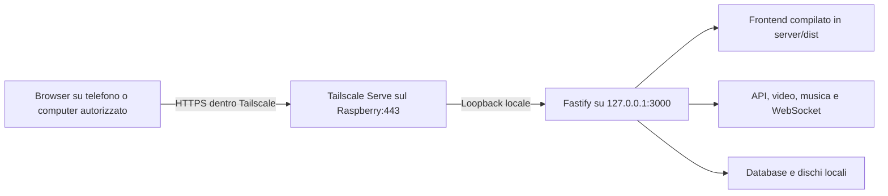

# Collegare mediaPiayer al Raspberry Pi in sicurezza

Aggiornamento dell’8 ottobre 2026: questo documento conserva l’analisi iniziale. Per l’implementazione desktop e le correzioni applicate successivamente, vedere [la guida operativa](app-desktop-tailscale.md). I rilievi sotto non descrivono tutti lo stato attuale del codice.

Studio del 7 ottobre 2026, basato sul codice locale e sulla documentazione ufficiale indicata in fondo. Il workspace contiene modifiche in corso: i riferimenti descrivono quanto osservato durante questa analisi. Non sono stati ispezionati Raspberry, router o account Tailscale. Questo è un piano di intervento, non una certificazione della configurazione installata.

La mia raccomandazione è servire frontend e backend dal Raspberry, raggiungibile soltanto dai dispositivi autorizzati attraverso Tailscale. Nessuna pubblicazione dell'app su Internet. A questo vanno aggiunte correzioni dell'app, isolamento dalla rete domestica e una modalità di visione senza cronologia.

La promessa realistica è impedire agli estranei di leggere i contenuti e ridurre le tracce di visione. Non si può promettere che "nessuno" sappia cosa guardi se controlla il dispositivo sul quale guardi o il Raspberry mentre serve il video. Anche con la cifratura restano osservabili alcuni metadati del traffico.

## Collegamento consigliato

Il frontend è già predisposto. `frontend/src/api.js:1` usa `/api`, Vite compila in `server/dist` e Fastify serve quella directory. In produzione apri un unico indirizzo HTTPS privato. Il codice React arriva dal Raspberry e gira nel browser; le chiamate API ritornano allo stesso indirizzo.

Non serve un hosting frontend separato. Pubblicarlo altrove richiederebbe gestire due origini, CORS, cookie e le restrizioni dei browser verso reti private; inoltre chi controlla quell'hosting potrebbe modificare il JavaScript che riceve le tue credenziali. Il backend privato resterebbe comunque raggiungibile soltanto con la VPN.

| Soluzione | Vantaggio | Limite | Valutazione |
| --- | --- | --- | --- |
| Tailscale privato + HTTPS sul Pi | Niente port forwarding, funziona normalmente anche con CGNAT, gestione dispositivi | Dipendenza dal servizio di coordinamento e relativi metadati | Consigliata per uso personale |
| WireGuard gestito da te | Maggiore controllo dell'infrastruttura | Chiavi, endpoint raggiungibile, eventuale VPS, DNS e certificati da gestire | Alternativa se vuoi gestire anche la VPN |
| Reverse proxy pubblico o tunnel pubblico | Accesso senza installare una VPN | App esposta, più controlli necessari; eventuale proxy TLS esterno vede le richieste | Non consigliato per questa esigenza |

Serve e Funnel sono diversi: Serve condivide nella rete Tailscale; Funnel pubblica su Internet. Verificare e disabilitare eventuali configurazioni Funnel. Non abilitare sul Pi il ruolo di subnet router o exit node per questo utilizzo.

## Chi può vedere cosa

| Osservatore | Con la configurazione proposta | Limite residuo |
| --- | --- | --- |
| Utente del Wi-Fi, operatore Internet, amministratore della rete da cui ti colleghi | Non legge video, titoli, URL interni o password nel tunnel | Può osservare IP, tempi, durata e volume. Può dedurre uno streaming e tentare correlazioni |
| Tailscale e relay DERP | Il traffico tra i dispositivi è cifrato end-to-end; i relay non decifrano i film | Il coordinamento tratta metadati di account, dispositivi e connessioni. Non equivale ad anonimato |
| Altro utente dell'app | La cronologia personale è filtrata per utente | Oggi presenza, richieste e party espongono informazioni aggiuntive. Servono le correzioni sotto |
| Amministratore/root del Raspberry | Il server conosce il file richiesto e lo legge per trasmetterlo | Può osservare la visione in tempo reale anche senza cronologia persistente |
| Persona con accesso al tuo telefono/computer | Dipende dalla protezione del dispositivo | Schermo, estensioni, cache, sessioni, cronologia, notifiche e malware possono rivelare la visione |
| Ladro che prende SD o SSD | Cifratura del disco con chiave separata protegge i dati a riposo | Un Pi acceso e già sbloccato, o una chiave salvata sullo stesso supporto, riducono la protezione |
| Partecipante a un watch party | Vede deliberatamente il contenuto condiviso | Non può essere nascosto a chi lo guarda con te |

Un certificato HTTPS pubblico può rendere pubblico il nome DNS del dispositivo nei registri Certificate Transparency. Usare un hostname neutro. Questo non pubblica i titoli guardati né rende accessibile il server.

## Problemi concreti dell'app

Le priorità P0 vanno affrontate prima di affidarsi al sistema per una visione riservata. P1 completa la protezione per un servizio personale sempre acceso. La gravità effettiva dipende da chi riesce a raggiungere l'app e leggere i log.

| Priorità | Evidenza nel repository | Conseguenza e intervento |
| --- | --- | --- |
| P0 | `server/server.js:38` oscura `req.query.token`, ma Fastify registra `req.url` | Il token resta nella query dell'URL registrato. Riprodotto localmente con Fastify e un token fittizio. Eliminare query e identificativi dei contenuti dai log delle richieste; coprire anche errori, proxy e journald |
| P0 | `frontend/src/pages/PartyRoom.jsx:133` usa `getToken()` nell’URL WebSocket | Il WebSocket trasporta il JWT principale, valido 7 giorni. Usare un ticket monouso legato al party o una sessione cookie sicura con controllo Origin. Il precedente uso del JWT principale per i sottotitoli è stato rimosso da modifiche concorrenti durante lo studio |
| P0 | `server/routes/auth.js:8` e `:39` | La registrazione è aperta. `ADMIN_INVITE_CODE` sceglie il ruolo, non chiude le iscrizioni: senza codice si diventa viewer. Bloccare la registrazione pubblica e creare utenti esplicitamente; inizializzare l'admin prima dell'accesso remoto |
| P0 | `server/routes/parties.js:66` | Il GET del party non verifica l'appartenenza. Un account autenticato che conosce l'ID riceve titolo, partecipanti, codice invito e percorsi dei file. Richiedere membership e restituire solo i campi necessari; l'imprevedibilità dell'ID non sostituisce il controllo |
| P0 privacy | `server/routes/watch.js`, `server/routes/music/index.js:49`, `server/db.js:5` | Progressi video e musica vengono persistiti in SQLite. Aggiungere una modalità privata imposta dal backend e una funzione per eliminare la cronologia già presente |
| P0 privacy | `server/routes/auth.js:88`, `server/server.js` hook `onResponse`, `server/routes/requests.js:48` e `:74` | Gli utenti vedono chi è online; le richieste includono titolo, autore e orario senza filtro per destinatari. Disattivare presenza/social per default o introdurre destinatari e consenso esplicito |
| P1 | `frontend/src/api.js:4`, `server/auth.js:9`, `frontend/src/context/AuthContext.jsx`, funzione `logout` | JWT in localStorage e logout senza revoca del token: un token copiato resta valido. La nuova route logout elimina il cookie dal browser ma non invalida il JWT. Usare sessioni revocabili per dispositivo con cookie HttpOnly, Secure e SameSite; revoca sul logout. La modifica password già incrementa `token_version` |
| P1 | `server/utils.js:88`, `server/routes/media.js:82`, `:112`, `:271`, `:279` | Video, immagini e sottotitoli autenticati sono marcati `public` in cache. Per la modalità privata usare `Cache-Control: private, no-store` anche su cronologia e risposte sensibili. `no-cache` permette comunque la memorizzazione |
| P1 | `server/server.js:29`, `:57`, `:65` | Il bind predefinito è su tutte le interfacce; senza `NODE_ENV=production` CORS è permissivo; CSP ammette script inline. Bind loopback, produzione esplicita, CSP più stretta e origini WebSocket limitate. CORS non è un sistema di autenticazione |
| P1 | `server/routes/music/youtube.js:26` | Il downloader accetta qualunque host HTTP/HTTPS. È riservato agli admin, ma rende importante limitare gli accessi di rete dal processo: allowlist dei servizi necessari e blocco LAN/loopback/link-local, anche dopo redirect e risoluzione DNS |
| P1 | `package.json`, `README.md` | Fastify 4 ha concluso il supporto ordinario il 30 giugno 2025. Node 20, consigliato dal README, è EOL alla data dello studio. Pianificare Fastify 5 con plugin compatibili e Node 24 LTS, verificando i moduli nativi ARM |

Durante la lettura sono arrivate modifiche locali che aggiungono al WebSocket il controllo del tipo di token e di `token_version`, a `mediaAuth` un fallback al cookie `media_access`, e una route logout che cancella il cookie. Sono miglioramenti da conservare e verificare nell'implementazione finale. Non risolvono da soli token negli URL WebSocket, accesso al GET del party o revoca dei socket già aperti. Il cookie è HttpOnly e SameSite=Strict, ma `Secure` dipende da `request.protocol`: dietro Serve con backend HTTP e senza una configurazione corretta del proxy può essere omesso. Imporre Secure nella configurazione HTTPS di produzione e verificare l'header ricevuto dal browser.

Le protezioni già presenti sono utili: password con bcrypt, controllo autenticazione sulle principali route media, ruoli admin sulle operazioni sensibili, limiti ai tentativi di login e query parametrizzate nei percorsi esaminati. La cronologia video viene restituita al suo proprietario. Il problema privacy riguarda anche la sua conservazione, non soltanto chi la legge via API.

Il controllo è mirato ad accesso, streaming e privacy. Non sono stati completati un penetration test, una verifica di tutte le route o un audit delle vulnerabilità di tutte le dipendenze. Non è stata dimostrata un'esecuzione remota di codice.

## Configurazione del Raspberry e della rete

1. Installare un sistema operativo a 64 bit ancora supportato e aggiornare OS, Tailscale, Node, ffmpeg, librerie native ed eventuali downloader. Usare un utente di servizio dedicato, senza sudo e senza chiavi SSH personali.
2. Compilare il frontend con dipendenze bloccate dai lockfile. Usare `npm ci` sia alla root sia in `frontend`, poi `npm run build` dalla root. Il servizio di produzione avvia Fastify; non esporre Vite sulla porta 5173.
3. Configurare `HOST=127.0.0.1`, `PORT=3000`, `NODE_ENV=production`. Generare separatamente segreti casuali per JWT e bootstrap admin, almeno 32 byte. Non inserirli nel repository o nel bundle frontend. File di configurazione leggibile solo dall'utente che ne ha bisogno.
4. Installare Tailscale sul Pi e sui dispositivi autorizzati. Proteggere l'identità con passkey o MFA, approvazione dei nuovi dispositivi e revoca tempestiva di quelli smarriti. Valutare Tailnet Lock se si accetta di gestire chiavi di firma e recupero.
5. Definire una policy Tailscale restrittiva: dispositivi spettatori verso il solo Pi sulla 443; SSH sulla 22 soltanto dal dispositivo amministrativo; niente accesso degli spettatori agli altri nodi. Non dare per scontato che la policy iniziale sia già restrittiva. Testare anche i divieti.
6. Pubblicare il servizio con Tailscale Serve HTTPS verso `http://127.0.0.1:3000`. Il comando di base documentato è `tailscale serve 3000`; per la configurazione persistente verificare `tailscale serve --help` nella versione installata e usare la modalità in background. Controllare `tailscale serve status` e `tailscale funnel status`.
7. Sul router eliminare eventuali inoltri verso 3000, 5173, SSH e Transmission. Disabilitare UPnP/NAT-PMP per le aperture automatiche non necessarie. Verificare anche IPv6: non dipende dal NAT IPv4. Un firewall sul Pi deve consentire soltanto il traffico necessario, incluso quello di Tailscale.
8. Per limitare un'intrusione dal Pi verso casa, metterlo in una VLAN o rete separata. Bloccare dal Pi l'accesso a router amministrativo, NAS, computer e IoT; consentire soltanto destinazioni indispensabili. Una rete ospiti è sufficiente solo se il router applica davvero queste restrizioni. Il firewall in ingresso da solo non impedisce al Pi compromesso di attaccare la LAN.
9. Gestire Fastify con systemd, restart controllato e limiti di memoria/processi. Applicare `NoNewPrivileges`, filesystem di sistema in sola lettura e directory scrivibili esplicite per database, upload, HLS e temporanei. Provare il servizio con ffmpeg prima di irrigidire ulteriormente la sandbox. Separare libreria di sola lettura e cartelle di importazione se possibile.
10. Separare deploy e runtime. Il processo web non deve poter riscrivere codice, avviare sudo o modificare il meccanismo di aggiornamento. `scripts/deploy-watcher.sh` aggiorna automaticamente da `main`: preferire revisioni approvate, dipendenze riproducibili, rollback e account di deploy distinto.

Non occorre Docker. Un container può limitare permessi e risorse, ma non sostituisce isolamento di rete e aggiornamenti. Per eventuali prove locali su Mac il runtime di questo ambiente è OrbStack.

Dietro Serve, verificare il rate limiting: il backend può vedere come client il proxy loopback. Non impostare `trustProxy: true` indiscriminatamente. Fidarsi solo del proxy effettivo e di header che esso sostituisce in modo affidabile, oppure limitare per sessione/account. Il login richiede una strategia separata per client non autenticati.

## Modifiche per la visione privata

La modalità privata dovrebbe essere il default e far rispettare queste regole sul server, anche se il frontend continua a inviare richieste di avanzamento:

- Nessuna scrittura di cronologia video o musica, aggiornamento della presenza, partecipazione automatica a richieste o party. Eventuali segnali in memoria per sospendere i processi in background devono scadere in pochi secondi o minuti e non diventare uno storico.
- Nessun titolo, percorso file, ID media, token, query string o URL grezzo nei log ordinari. Registrare eventi di sicurezza minimi e categorie di route, con retention breve ed esplicita, per esempio 7 giorni. Valutare separatamente indirizzi IP e identificativi account necessari a investigare abusi.
- Nessuna cache condivisa per dati autenticati. In modalità privata chiedere al browser di non conservare risposte sensibili; mantenere cache lunga solo per JS/CSS statici privi di dati personali. Gli header non cancellano retroattivamente ciò che è già stato memorizzato.
- Cookie di sessione HttpOnly e Secure, SameSite adeguato alla configurazione a singola origine; protezione CSRF sulle operazioni che modificano dati e validazione Origin sui WebSocket. I cookie proteggono dalla lettura del token da JavaScript, ma non rendono innocuo un XSS.
- Se rimangono token media nell'URL, limitarli a contenuto, uso e durata; non accettare il JWT principale nella query. Prevedere rinnovo durante film lunghi e proteggere manifest, segmenti HLS, sottotitoli e audio alternativi. La soluzione va provata anche con Safari e HLS nativo.
- Chiudere socket e sessioni quando vengono revocati, non soltanto alla connessione successiva. Prevedere "disconnetti tutti i dispositivi" e l'elenco delle sessioni autorizzate.
- Disabilitare analytics, risorse remote e integrazioni non necessarie. Verificare nel browser le richieste realmente emesse, comprese quelle delle librerie. La compilazione locale del frontend semplifica questo controllo.

Se vuoi conservare "continua a guardare", bisogna scegliere dove mantenere il progresso. Salvarlo solo sul dispositivo evita lo storico sul Pi ma lascia tracce sul dispositivo e perde la sincronizzazione. Sincronizzarlo cifrato con chiavi controllate dal client può proteggere il database da una lettura offline, ma il server che trasmette il file continua a conoscere la richiesta in tempo reale. Non è indispensabile per la prima versione.

Eliminare vecchie righe SQLite non equivale a cancellazione forense. Bisogna includere WAL, backup, log, cache e snapshot nella politica di rimozione; su SD/SSD il wear leveling limita le garanzie di sovrascrittura. La difesa più efficace è non registrare i dati e cifrare i supporti fin dall'inizio.

Sul telefono/computer usare cifratura del dispositivo, blocco schermo, account personale e poche estensioni affidabili. La navigazione privata riduce alcune tracce locali ma non nasconde l'attività al server, a malware o a chi vede lo schermo. Evitare titoli nelle notifiche e nelle schermate condivise.

## Se qualcuno entra fisicamente in casa

La VPN non protegge una SD estratta dal Raspberry. Cifrare con LUKS i volumi che contengono media, database, cache di transcodifica e backup; collocare anche swap e temporanei sensibili su supporti protetti o disabilitarli quando appropriato. Valutare separatamente credenziali e stato Tailscale presenti sul disco di sistema: un disco media cifrato non li protegge automaticamente.

La chiave di sblocco non deve stare in chiaro sullo stesso dispositivo. Serve quindi una scelta pratica: sblocco manuale dopo riavvio, oppure un meccanismo remoto o hardware progettato e verificato per quel modello. L'avvio automatico dopo un blackout è più comodo, ma conservare la chiave localmente indebolisce la protezione contro il furto. Prevedere backup delle chiavi custoditi altrove e una prova di recupero.

Un Pi acceso con il volume sbloccato continua a poter leggere i file. La cifratura a riposo non protegge da root, RAM acquisita o manipolazione dell'avvio. Se il dispositivo viene manomesso, ricostruirlo da un sistema fidato prima di reinserire le chiavi.

In caso di furto revocare il nodo Tailscale, le sessioni dell'app e le credenziali presenti sul Pi, incluse eventuali chiavi di deploy. La revoca impedisce accessi futuri alla rete ma non cancella dati già copiati.

## Download e streaming sono due problemi diversi

La connessione Tailscale browser-Pi protegge la visione. Non instrada automaticamente in una VPN anonima i download Internet eseguiti dal Pi.

Transmission espone ai peer e ai tracker l'indirizzo con cui partecipa allo swarm e l'identificativo del torrent. YouTube e altri servizi vedono le richieste inviate loro da `yt-dlp`. Una VPN commerciale può spostare parte della fiducia verso il suo gestore; non garantisce invisibilità. Se si decide di usarla per i downloader, occorrono routing separato, gestione DNS/IPv6 e blocco dei download quando il tunnel cade.

Per la prima configurazione privata conviene disattivare downloader e integrazioni non indispensabili. Se abilitati, isolarli dal processo web e dalla LAN; lasciare Transmission RPC su loopback con autenticazione. Limitare concorrenza, spazio disco e risorse di upload/transcodifica per evitare che un account compromesso blocchi il Pi.

## Verifiche prima dell'uso remoto

| Prova | Risultato richiesto |
| --- | --- |
| Telefono su rete mobile, Tailscale spento | L'app non è raggiungibile; nessuna esposizione pubblica del Pi, anche su IPv6 |
| Dispositivo nella LAN ma non autorizzato | Non raggiunge Fastify direttamente sulla 3000 |
| Dispositivo Tailscale non autorizzato | Non accede all'app né a SSH; regole verificate con prove negative |
| Dispositivo autorizzato, sessione assente | Catalogo privato, video, immagini, sottotitoli, HLS e WebSocket rifiutano l'accesso |
| Due account distinti | Nessun accesso a cronologia o party altrui; richieste social limitate ai destinatari |
| Logout, revoca e cambio password | Vecchie sessioni, token, ticket e socket non funzionano più secondo la policy definita |
| Visione privata di un contenuto di prova | Nessuna nuova cronologia o presenza persistente; log senza token, ID, titoli o URL sensibili |
| Visione lunga oltre la durata del token media | Film, seek, sottotitoli e HLS continuano senza aggirare l'autenticazione |
| Riavvio e perdita di corrente | Servizio e VPN ripartono come previsto; comportamento dello sblocco disco documentato |
| Ripristino backup su ambiente separato | Dati recuperabili, backup cifrato, retention e vecchie credenziali gestite |
| Tentativo dal Pi verso dispositivi domestici | La separazione di rete blocca le destinazioni non autorizzate |

Misurare inoltre l'upload di casa, non soltanto il download: deve sostenere la somma dei bitrate con margine per i picchi. Preferire Ethernet e file già compatibili con i client. Transcodifica in tempo reale e relay possono diventare colli di bottiglia; le prestazioni dipendono da modello del Pi, codec e numero di spettatori. Non aprire porte pubbliche come rimedio a un problema di prestazioni.

## Ordine di lavoro e impegno previsto

1. Inventario di Pi, sistema operativo, router, client e configurazione corrente; backup protetto. Configurazione privata Tailscale/HTTPS, bootstrap admin e chiusura registrazioni.
2. Correzioni P0: log, credenziali negli URL, autorizzazione party, presenza e cronologia. Validazione con almeno due utenti e un dispositivo non autorizzato.
3. Sessioni revocabili, cache, CSRF/CSP, aggiornamento runtime e dipendenze. Verifica streaming lunga e sui client reali.
4. Isolamento LAN, servizio con privilegi minimi, cifratura, backup e procedure per furto o compromissione.

Per pianificare, stimerei 1-2 giornate per rete e deploy privato, 3-6 per correzioni applicative e verifiche, 1-3 per isolamento, dischi e recupero. Sono stime ingegneristiche, non un preventivo: router senza VLAN, migrazione delle dipendenze e compatibilità TV possono richiedere più lavoro. La sola modalità privata non va considerata un interruttore del frontend.

Non serve necessariamente un dominio o un VPS. Verificare il piano Tailscale disponibile al momento dell'installazione. Possibili costi aggiuntivi sono SSD, supporto per backup, UPS e router con separazione di rete.

Le informazioni ancora necessarie per trasformare lo studio in configurazione eseguibile sono modello/RAM del Raspberry, OS e versioni installate, modello del router, presenza di accesso remoto già attivo, dispositivi di visione, numero di utenti e scelta tra cronologia sincronizzata e nessuna cronologia. Per TV e dispositivi senza client Tailscale va progettato l'accesso prima di aprire servizi aggiuntivi.

## Fonti e verifica eseguita

- [Tailscale Serve](https://tailscale.com/kb/1312/serve), condivisione privata HTTPS e distinzione da Funnel.
- [Sicurezza Tailscale](https://tailscale.com/security), cifratura tra dispositivi e metadati del coordinamento.
- [HTTPS e Certificate Transparency](https://tailscale.com/kb/1153/enabling-https), pubblicazione dei nomi dei certificati.
- [Tailnet Lock, whitepaper](https://tailscale.com/docs/concepts/tailnet-lock-whitepaper), controllo delle chiavi autorizzate.
- [Supporto delle versioni Node.js](https://nodejs.org/en/about/previous-releases).
- [Supporto delle versioni Fastify](https://fastify.dev/docs/latest/Reference/LTS/).

Le fonti sopra sono state consultate durante lo studio. Il test locale sui log ha usato `Fastify.inject` su una route fittizia e la stessa configurazione `redact` del progetto: il valore fittizio `FAKE_SECURITY_PROBE` è rimasto in `req.url`. Non sono stati usati token reali, letti dati personali nel database o cambiati servizi e configurazioni del Raspberry.
